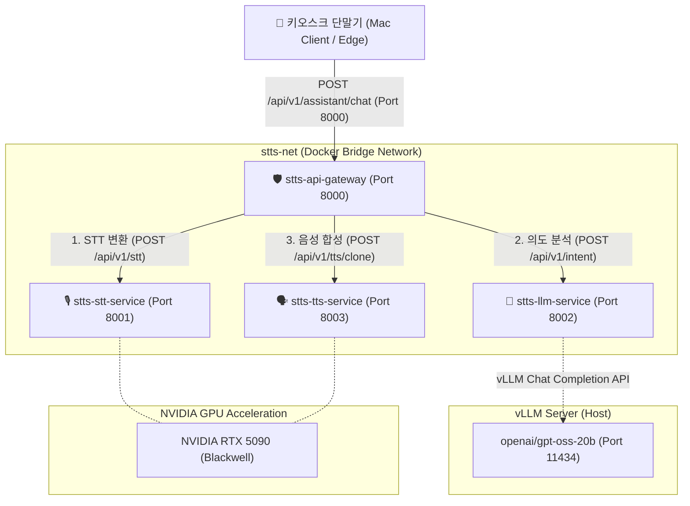

# RTX 5090 기반 한국어 배리어프리 AI 키오스크 음성 비서 마이크로서비스 (STTS)

본 프로젝트는 **NVIDIA GeForce RTX 5090 GPU (Blackwell 아키텍처, CUDA 13.0 호환)** 환경에서 구축된 **Docker Compose 기반 마이크로서비스(MSA) 음성 비서 파이프라인** 프로젝트입니다.

키오스크 마이크 입력부터 **Whisper STT ➔ vLLM(OpenAI/gpt-oss-20b) Intent Engine ➔ Qwen3-TTS Zero-Shot Voice Cloning ➔ 음성 피드백**으로 이어지는 End-to-End 음성 비서 파이프라인을 완전 독립 컨테이너 모듈로 설계하였습니다.

---

## 🏗️ 전체 마이크로서비스 아키텍처 (MSA)



---

## 📁 디렉토리 구조 명세

```
/home/toor/tmp/test-STTS/
├── docker/                           # Docker 환경 및 제어 스크립트
│   ├── compose/
│   │   ├── docker-compose.yml        # MSA 4개 서비스 정의
│   │   └── .env                      # Docker Compose 환경 변수
│   ├── image/                        # Dockerfile 정의
│   │   ├── api-gateway/Dockerfile    # API Gateway 이미지
│   │   ├── stt-service/Dockerfile    # Whisper STT 이미지
│   │   ├── llm-service/Dockerfile    # LLM Intent Engine 이미지
│   │   └── tts-service/Dockerfile    # Qwen3-TTS 이미지
│   ├── build.sh                      # 이미지 일괄 빌드 스크립트
│   ├── start.sh                      # 컨테이너 일괄 구동 스크립트
│   ├── stop.sh                       # 컨테이너 종료 스크립트
│   ├── restart.sh                    # 재시작 스크립트
│   ├── status.sh                     # 컨테이너 상태 점검 스크립트
│   └── logs.sh                       # 실시간 로그 스트리밍 스크립트
├── src/                              # 백엔드 및 클라이언트 소스코드
│   ├── api-gateway/                  # API Gateway (app.py, requirements.txt)
│   ├── stt-service/                  # Whisper STT 서비스 (app.py, requirements.txt)
│   ├── llm-service/                  # LLM Intent 서비스 (app.py, requirements.txt - vLLM 연동)
│   ├── tts-service/                  # Qwen3-TTS 클로닝 서비스 (app.py, ref_voices/)
│   ├── edge/                         # 엣지 단말기 테스트 클라이언트
│   │   ├── mac-test.py               # Mac 실시간 마이크/스피커 인터랙티브 테스트
│   │   ├── kiosk_edge_client.py      # 엣지 단말기 E2E 파이프라인 테스트
│   │   ├── requirements.txt          # 엣지 단말 전용 패키지
│   │   └── README.md                 # 엣지 가이드
│   └── test_e2e_pipeline.py          # E2E 파이프라인 자동 테스트 스크립트
├── VIBE-WORK/                        # 기획 및 실행 계획 문서
│   ├── WANT.md                       # 요구사항 명세
│   ├── ARCHITECTURE.md               # Mermaid 아키텍처 문서
│   ├── IMP-PLAN.md                   # 마스터 구현 계획서 (Phase 1 ~ Phase 6)
│   └── PHASE-01.md ~ PHASE-06.md     # 각 단계별 검증 결과보고서
├── test-KittenTTS/                   # (테스트) ONNX 경량 KittenTTS
├── test-Qwen3-TTS/                   # (테스트) Qwen3-TTS 1.7B 로컬 테스트
└── test-chatterbox/                  # (테스트) Chatterbox 다국어 TTS
```

---

## 🐳 Docker 컨테이너 및 OpenAPI 주소

### 1. 서비스 컨테이너 매핑

| 서비스 모듈 | Docker 이미지 (`IMAGE`) | 컨테이너 명칭 (`CONTAINER`) | 바인딩 포트 |
| :--- | :--- | :--- | :---: |
| **API Gateway** | `stts-api-gateway:latest` | `stts-api-gateway` | `8000` |
| **Whisper STT** | `stts-stt-service:latest` | `stts-stt-service` | `8001` |
| **LLM Intent Engine** | `stts-llm-service:latest` | `stts-llm-service` | `8002` |
| **Qwen3-TTS Cloning** | `stts-tts-service:latest` | `stts-tts-service` | `8003` |

### 2. 원격 OpenAPI (Swagger UI) 접속 주소 (`ugai-sg.nb.is`)

* **통합 API Gateway (메인)**: 👉 **`http://ugai-sg.nb.is:8000/docs`**
* **Whisper STT Service**: 👉 `http://ugai-sg.nb.is:8001/docs`
* **LLM Intent Engine Service**: 👉 `http://ugai-sg.nb.is:8002/docs`
* **Qwen3-TTS Voice Service**: 👉 `http://ugai-sg.nb.is:8003/docs`

---

## 🛠️ 구동 및 관리 방법

### 1. 마이크로서비스 일괄 구동 및 제어
```bash
# 이미지 빌드
./docker/build.sh

# 컨테이너 일괄 구동
./docker/start.sh

# 상태 확인
./docker/status.sh

# 로그 모니터링
./docker/logs.sh

# 컨테이너 재시작
./docker/restart.sh

# 컨테이너 정지
./docker/stop.sh
```

---

## 🎙️ 엣지 단말기 & Mac 실시간 대화 테스트

### 1. Mac 실시간 마이크 인터랙티브 테스트 (`mac-test.py`)
Mac 내장 마이크로 4초간 음성을 직접 녹음하여 원격 서버로 전송하고, AI 키오스크 답변 음성을 Mac 스피커(`afplay`)로 즉시 들을 수 있습니다.

```bash
# 엣지 패키지 설치
pip install -r src/edge/requirements.txt

# Mac 마이크 대화 테스트 실행 (Enter 키 입력 후 말하기)
python3 src/edge/mac-test.py

# 녹음 시간 지정 (예: 6초 녹음)
python3 src/edge/mac-test.py --duration 6 --gateway http://ugai-sg.nb.is:8000
```

### 2. 파일 기반 엣지 단말 시뮬레이션 테스트
```bash
python3 src/edge/kiosk_edge_client.py --gateway http://ugai-sg.nb.is:8000 --audio /path/to/audio.wav
```

---

## 🌟 핵심 기술 및 비즈니스 어필 포인트

1. **20B 대형 언어 모델(vLLM `openai/gpt-oss-20b`) 실시간 연동**
   - 사용자 음성을 STT 변환 후 20B LLM이 의도(`ORDER`, `RECOMMEND`, `INFO`) 분석 및 자연스러운 키오스크 답변 문장을 실시간 추론.
2. **Zero-Shot ICL 보Voice Cloning (Qwen3-TTS 1.7B)**
   - 단 수 초의 점주/브랜드 참조 음성만으로 브랜드 전속 아나운서/점주 목소리를 감성적으로 복제하여 답변 음성 스트리밍 반환.
3. **독립 마이크로서비스(MSA) & 부하 분산 스케일 아웃**
   - 각 모듈이 독립된 Docker 컨테이너로 분리되어 다중 키오스크 요청 발생 시 `docker compose scale stt-service=2 tts-service=2`와 같이 유연한 부하 분산 지원.
4. **RTX 5090 Blackwell 최신 GPU 가속 최적화**
   - PyTorch CUDA 13.0 (`cu130`) 빌드를 적용하여 최첨단 AI 하드웨어 자원을 극대로 활용.
