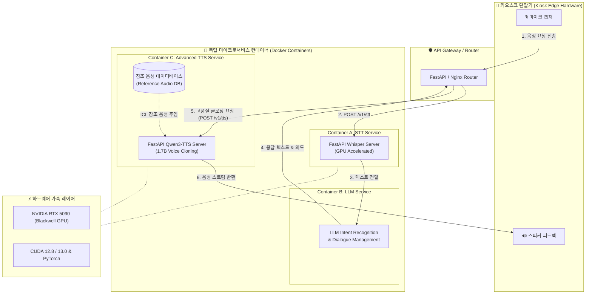

# 배리어프리 키오스크 음성 비서 모듈화 아키텍처

본 문서는 **키오스크 마이크 입력 → STT → LLM(의도 파악) → TTS**로 이어지는 음성 비서 모듈화 파이프라인과 독립 마이크로서비스(MSA) 아키텍처를 정의합니다.

> [!NOTE]
> **아키텍처 구성 참고사항**:
> 오프라인/초저지연 온디바이스 TTS 응답 경로(구 5b, 6b 흐름)는 현재 1차 백엔드 MSA 구성에서 일단 제외하였으며, 아래 아키텍처 및 주석(Comment)으로 추후 확장 옵션으로 유지 관리합니다.

---

## 1. 음성 비서 핵심 모듈화 파이프라인 (Core Pipeline Flow)

```mermaid
flowchart LR
    %% Module Nodes
    subgraph Step1 ["1단계: 음성 입력"]
        Mic["🎙️ 키오스크 마이크 입력<br/>(Audio Stream / PCM)"]
    end

    subgraph Step2 ["2단계: STT 모듈"]
        WhisperSTT["🎙️ Whisper STT Engine<br/>(Speech-to-Text)"]
    end

    subgraph Step3 ["3단계: LLM 의도 파악 모듈"]
        LLM["🧠 LLM Intent Engine<br/>(의도 파악 & 대화 처리)"]
    end

    subgraph Step4 ["4단계: TTS 모듈"]
        TTS["🗣️ Advanced TTS Engine<br/>(Qwen3-TTS Voice Cloning)"]
    end

    subgraph Step5 ["5단계: 음성 피드백"]
        Speaker["🔊 키오스크 스피커 출력<br/>(Audio Output)"]
    end

    %% Pipeline Connections
    Mic -->|"Audio Payload"| WhisperSTT
    WhisperSTT -->|"Recognized Text"| LLM
    LLM -->|"Response Text & Intent"| TTS
    TTS -->|"High-Quality Audio Stream"| Speaker

    %% Styling
    classDef step1Style fill:#e3f2fd,stroke:#1e88e5,stroke-width:2px,color:#0d47a1;
    classDef step2Style fill:#fff3e0,stroke:#fb8c00,stroke-width:2px,color:#e65100;
    classDef step3Style fill:#f3e5f5,stroke:#ab47bc,stroke-width:2px,color:#4a148c;
    classDef step4Style fill:#e8f5e9,stroke:#43a047,stroke-width:2px,color:#1b5e20;
    classDef step5Style fill:#fce4ec,stroke:#e91e63,stroke-width:2px,color:#880e4f;

    class Mic step1Style;
    class WhisperSTT step2Style;
    class LLM step3Style;
    class TTS step4Style;
    class Speaker step5Style;
```

---

## 2. Docker & FastAPI 마이크로서비스(MSA) 전체 구조도

---

## 3. 모듈별 기능 및 입출력 인터페이스 (Module Specifications)

| 모듈명 | 주요 기능 | 입력 (Input) | 출력 (Output) | 비고 |
| :--- | :--- | :--- | :--- | :--- |
| **1. 마이크 입력 모듈** | 키오스크 사용자 음성 캡처 | 사용자의 음성 발성 | Audio PCM Stream / WAV | 16kHz/24kHz 샘플링 |
| **2. STT 모듈** | 음성을 텍스트로 변환 | Audio File / Stream | Text String (한국어) | Whisper (GPU 가속) |
| **3. LLM 의도 파악 모듈** | 사용자 주문/안내 의도 분석 | Text String | Response Text & Intent JSON | 키오스크 메뉴/주문 로직 연동 |
| **4. TTS 모듈** | 텍스트를 고품질 보이스로 합성 | Response Text String | Audio Stream / WAV File | Qwen3-TTS (1.7B Voice Cloning) |
| **5. 음성 피드백 모듈** | 사용자에게 최종 음성 출력 | Audio Stream | 스피커 출력 (Sound Feedback) | 배리어프리 인터페이스 |

---

### 📝 코멘트 (제외된 경로 명세)
* **구 5b (오프라인/초저지연 경로)**: `API Gateway → LocalTTS (KittenTTS/ONNX)`
* **구 6b (경량 오디오 출력 경로)**: `LocalTTS → AudioOutput`
* **제외 사유**: 1차 시스템 구축 시에는 GPU 기반 고품질 Qwen3-TTS 보이스 클로닝 단일 파이프라인(5, 6번 경로)에 집중하기 위해 온디바이스 파이프라인(5b, 6b)을 메인 흐름에서 제외하였으며, 향후 오프라인 백업용 확장 모듈로 코멘트 보관합니다.
