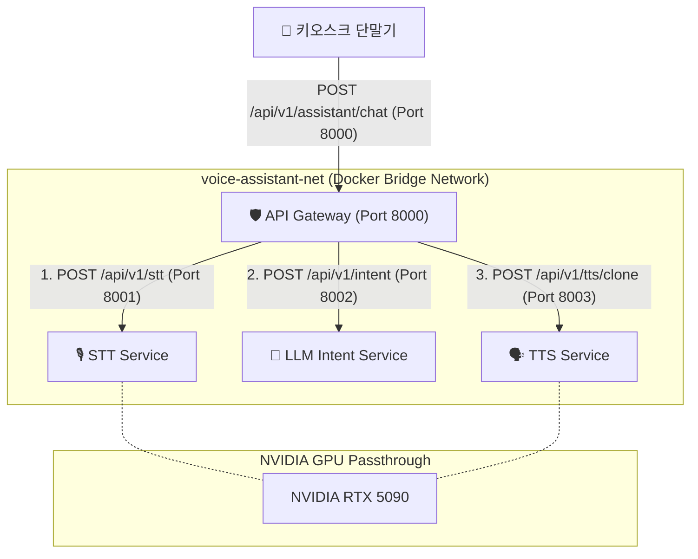

# Phase 5: Docker Compose 오케스트레이션 구동 환경 구성 진행 결과 (PHASE-05.md)

**수행 일자**: 2026-07-27  
**상태**: ✅ **완료 (Completed)**

---

## 📌 Phase 5 진행 결과 요약

| 항목 | 디렉토리 / 파일 경로 | 상태 |
| :--- | :--- | :---: |
| **API Gateway 소스 코드** | `src/api-gateway/app.py` (`POST /api/v1/assistant/chat`, `GET /health`) | ✅ 성공 |
| **API Gateway Dockerfile** | `docker/image/api-gateway/Dockerfile` | ✅ 성공 |
| **Docker Compose 설정** | `docker/compose/docker-compose.yml` (4개 마이크로서비스 및 GPU Passthrough) | ✅ 성공 |
| **환경 변수 구성** | `docker/compose/.env` | ✅ 성공 |

---

## 🔍 서비스 오케스트레이션 매핑 스펙

---

## 📋 IMP-PLAN.md Phase 5 체크리스트 업데이트

- [x] **5.1 Docker Compose 설정 파일 작성 (`docker/compose/docker-compose.yml`)**
  - [x] `stt-service`, `llm-service`, `tts-service`, `api-gateway` 4개 서비스 정의
  - [x] GPU 리소스 할당 명시 (`deploy.resources.reservations.devices` nvidia GPU 설정)
  - [x] 컨테이너 간 분리된 내부 프라이빗 브릿지 네트워크 (`voice-assistant-net`) 구축
  - [x] 참조 음성 데이터 persistence 볼륨 바인딩 (`../../src/tts-service/ref_voices`)
- [x] **5.2 환경 변수 및 의존성 헬스체크 설정**
  - [x] `docker/compose/.env` 서비스 공통 환경 변수 파일 작성
  - [x] 컨테이너 순차 부팅을 위한 `healthcheck` 및 `depends_on: condition: service_healthy` 지정
- [x] **5.3 API Gateway (FastAPI Router) 오케스트레이션 연동**
  - [x] `src/api-gateway/app.py` 및 `docker/image/api-gateway/Dockerfile` 작성
  - [x] STT ➔ LLM ➔ TTS 모듈 간 파이프라인 단일 호출 라우팅 (`POST /api/v1/assistant/chat`) 완성
