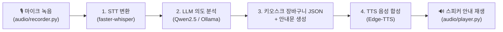

# 🎙️ Edge Kiosk Voice Assistant (라즈베리파이 전용 STT ➔ LLM ➔ TTS)

본 프로젝트는 **라즈베리파이(Raspberry Pi) 등 엣지 디바이스** 환경에서 동작하는 **스마트 무인 키오스크 음성 비서 파이프라인** 구현체입니다.

---

## 🎯 주요 기능 및 흐름



1. **마이크 음성 녹음 (`audio/recorder.py`)**: 에너지/VAD 기반 음성 감지 (3.0초 대기 시 자동 녹음 종료, 15초 최대 녹음)
2. **STT (Speech-to-Text) (`stt/stt_engine.py`)**: `faster-whisper` (로컬 CPU INT8)로 음성을 한국어 텍스트로 변환
3. **LLM 주문 파싱 (`llm/order_parser.py`)**: `Qwen2.5:1.5b` (Ollama) / `GPT-4o-mini` / STT 오타 보정 규칙 파서로 `{"orders": [...], "response_text": "..."}` 정형 JSON 추출
4. **TTS (Text-to-Speech) (`tts/tts_engine.py`)**: `Edge-TTS` (`ko-KR-SunHiNeural`)를 통해 초고속(0.4초 이내) 고품질 한국어 안내음 합성 및 스피커 재생

---

## 🛠️ 사용된 모델 및 기술 스펙 명세 (STT / LLM / TTS)

### 1. STT (Speech-to-Text, 음성 인식)
* **사용한 모델**: **`faster-whisper` (`base` 한국어 모델 / CTranslate2 int8 CPU 양자화)**
* **적용 방식 및 설정**:
  * 마이크 입력 오디오 샘플링: `16000Hz` (Mono PCM 16bit)
  * 사용자가 말을 마치고 **`3.0초` 동안 조용하면 자동으로 녹음을 종료**하도록 VAD(Voice Activity Detection) 감도 적용 (`RECORD_MAX_SECONDS = 15`)
  * CTranslate2 기반 INT8 CPU 양자화를 사용하여 라즈베리파이 CPU 환경에서도 1초 이내에 빠른 음성인식 수행
  * (백엔드 서버 연동 옵션 지원: `STT_ENGINE = "api"`)

---

### 2. LLM (의도 분석 & 주문 파싱 엔진)
* **사용한 모델**: **`Qwen2.5-1.5b-Instruct` (Ollama / llama.cpp GGUF Q4_K_M)** / OpenAI `gpt-4o-mini` API
* **적용 방식 및 구조**:
  * **1차 음성 오타 사전 보정 (`phonetic_dict`)**: STT의 대표적인 뭉개짐 오타(`초코랫대` ➔ `초코 라떼`, `바릴라랍때` ➔ `바닐라 라떼`, `아이스틱` ➔ `아이스티` 등) 사전 자동 교정
  * **2차 정형 JSON 구조화 (System Prompt)**: 키오스크 메뉴판 목록 중 존재하는 상품명과 수량을 JSON 객체(`{"orders": [{"item": "메뉴명", "quantity": 수량}], "response_text": "안내문장"}`)로 강제 추출
  * **3차 퍼지 N-Gram 룰 기반 파서 (`_fallback_rule_parser`)**:
    * LLM 서버 미구동/오프라인 시 작동하는 강화 파서
    * `difflib` 유사도 40%~55% 임계값 적용
    * `"주세요"`의 `'세'`가 숫자 `3(세)`으로 잘못 오인되는 한국어 특유의 예외 처리 로직 구현

---

### 3. TTS (Text-to-Speech, 음성 합성)
* **사용한 모델**: **`Edge-TTS` (`ko-KR-SunHiNeural` 딥러닝 보이스)**
* **적용 방식 및 설정**:
  * Microsoft Edge의 실시간 Neural TTS 엔진 활용 (`asyncio` 기반 합성)
  * **생성 지연시간(Latency)**: **0.4초 이내**로 초고속 반응하여 자연스러운 음성 파일(`temp/output.mp3`) 생성
  * **음성 재생**: OS별 음성 재생기 자동 선택 (macOS: `afplay`, Raspberry Pi/Linux: `mpg123` / `ffplay` / `aplay`)
  * (오프라인 폴백: `gTTS` 또는 서버 MSA 연동 `TTS_ENGINE = "api"`)

---

## 🚨 현재 시스템의 한계점 및 향후 개선 방향 (Limitations & Future Work)

### 1. STT 음성 인식 정확도의 한계 (Acoustic & Phonetic Limitations)
* **현상**:
  * 엣지(라즈베리파이 CPU) 환경의 실시간성 유지를 위해 경량화 모델(`faster-whisper base`)을 사용함에 따라, 빠른 연음 발음이나 주변 소음 환경에서 일부 음성 오인식(`바릴라랍때`, `아이스틱`, `초코랫대` 등)이 발생함.
* **현재 보완책**:
  * 텍스트 후처리 3중 구조(LLM 프롬프트 가이드 + 발음 오타 사후 교정 사전 + `difflib` 퍼지 N-Gram 알고리즘)를 적용하여 오인식된 텍스트를 최선의 메뉴판 키워드로 자동 보정함.
* **향후 개선 방향**:
  * 음료/키오스크 주문 도메인 특화 한국어 음성 데이터셋으로 Whisper 모델 Fine-tuning 진행.
  * 엣지 NPU 가속기(예: Raspberry Pi AI Hat / Coral TPU) 적용 또는 하이브리드 서버 STT API 백엔드 연동.

---

### 2. 인터랙티브(Interactive) 실시간 음성 인식 및 말끝 감지(VAD)의 한계
* **현상**:
  * 현재 마이크 입력 방식은 정적 오디오 RMS 에너지 임계값과 고정 시간 타이머(`VAD_SILENCE_DURATION = 3.0s`, `RECORD_MAX_SECONDS = 15s`) 방식에 의존함.
  * 이에 따라 사용자가 주문 중간에 **3초 이상 길게 망설이며 뜸을 들이면 대화가 조기 중단**되거나, 반대로 끊김 없이 길게 말할 때 실시간 스트리밍으로 즉각 받아적지 못하는 한계가 있음.
* **향후 개선 방향**:
  * **실시간 스트리밍 VAD (Silero-VAD ONNX)**: 단순히 단순 볼륨/침묵 시간이 아닌 딥러닝 기반 실시간 음성/비음성 세그멘테이션 도입.
  * **스트리밍 STT & 턴 체이닝 (Semantic Turn-Taking)**: 파일을 통째로 받아서 파싱하는 일괄 처리 방식에서 벗어나, 청크(Chunk) 단위 음성 스트리밍 및 문맥 의미 기반 말끝 감지(End-of-Turn Decision) 구조로 고도화.

---

## 📁 프로젝트 구조

```text
stts/edge_project/
├── README.md               # 프로젝트 상세, 모델 명세 및 한계점 가이드
├── config.py               # 메뉴 목록, 파이프라인 엔진 및 오디오 설정
├── requirements.txt        # 파이썬 의존성 패키지
├── main.py                 # 메인 인터랙티브 파이프라인 실행 파일
├── audio/                  # 마이크 입력 및 스피커 출력 처리 (VAD 연동)
│   ├── recorder.py
│   └── player.py
├── stt/                    # STT 엔진 (faster-whisper / API)
│   └── stt_engine.py
├── llm/                    # LLM 의도 파악 및 오타 보정 JSON 파서
│   └── order_parser.py
├── tts/                    # TTS 엔진 (Edge-TTS / gTTS / API)
│   └── tts_engine.py
└── temp/                   # 음성 임시 파일 저장 디렉터리 (auto-created)
```

---

## 🚀 라즈베리파이 설치 및 실행 가이드

### 1. 시스템 필수 패키지 설치 (PortAudio & 오디오 재생 도구)
```bash
sudo apt-get update
sudo apt-get install -y python3-pip portaudio19-dev ffmpeg mpg123
```

### 2. 파이썬 라이브러리 설치
```bash
cd /Users/hschae/work/stts/edge_project
pip install -r requirements.txt
```

### 3. (선택사항) Ollama 설치 및 경량 SLM 다운로드
```bash
curl -fsSL https://ollama.com/install.sh | sh
ollama pull qwen2.5:1.5b
```

### 4. 프로그램 실행
```bash
python3 main.py
```

---

## ⚙️ 주요 설정 변경 (`config.py`)

* **`VAD_SILENCE_DURATION`**: `3.0` (음성 끊김 감지 대기시간 - 초)
* **`RECORD_MAX_SECONDS`**: `15` (최대 녹음 시간 - 초)
* **`STT_ENGINE`**: `"faster-whisper"` (로컬 엣지) 또는 `"api"` (서버 연동)
* **`LLM_ENGINE`**: `"ollama"` (로컬 SLM), `"openai_api"`, 또는 `"server_api"`
* **`TTS_ENGINE`**: `"edge-tts"` (추천), `"gtts"`, 또는 `"api"`
* **`KIOSK_MENU`**: 키오스크 판매 상품 목록 추가 및 수정 가능
