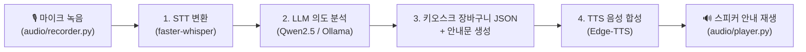

# 🎙️ Edge Kiosk Voice Assistant (라즈베리파이 전용 STT ➔ LLM ➔ TTS)

본 프로젝트는 **라즈베리파이(Raspberry Pi) 등 엣지 디바이스** 환경에서 동작하는 **스마트 무인 키오스크 음성 비서 파이프라인** 구현체입니다.

---

## 🎯 주요 기능 및 흐름



1. **마이크 음성 녹음 (`audio/recorder.py`)**: 에너지/VAD 기반으로 사용자가 말을 멈추면 자동으로 녹음 종료
2. **STT (Speech-to-Text) (`stt/stt_engine.py`)**: `faster-whisper` (로컬 CPU int8 양자화) 또는 REST API로 음성을 한국어 텍스트로 변환
3. **LLM 주문 파싱 (`llm/order_parser.py`)**: `Qwen2.5:1.5b` (Ollama) 또는 규칙기반 파서로 `{"아이스 아메리카노": 2}` 형태의 정형 JSON 및 안내문 생성
4. **TTS (Text-to-Speech) (`tts/tts_engine.py`)**: `Edge-TTS` (`ko-KR-SunHiNeural`)를 통해 자연스러운 고품질 한국어 안내음 생성 및 재생

---

## 📁 프로젝트 구조

```text
stts/edge_project/
├── README.md               # 프로젝트 가이드
├── config.py               # 메뉴 목록, 파이프라인 엔진 및 오디오 설정
├── requirements.txt        # 파이썬 의존성 패키지
├── main.py                 # 메인 인터랙티브 파이프라인 실행 파일
├── audio/                  # 마이크 입력 및 스피커 출력 처리
│   ├── recorder.py
│   └── player.py
├── stt/                    # STT 엔진 (faster-whisper / API)
│   └── stt_engine.py
├── llm/                    # LLM 의도 파악 및 JSON 파서 (Ollama / OpenAI / Rule-based)
│   └── order_parser.py
├── tts/                    # TTS 엔진 (Edge-TTS / gTTS / API)
│   └── tts_engine.py
└── temp/                   # 음성 임시 파일 저장 디렉터리 (auto-created)
```

---

## 🚀 라즈베리파이 설치 및 실행 가이드

### 1. 시스템 필수 패키지 설치 (PortAudio & 오디오 재생 도구)
```bash
sudo apt-get update
sudo apt-get install -y python3-pip portaudio19-dev ffmpeg mpg123
```

### 2. 파이썬 라이브러리 설치
```bash
cd /Users/hschae/work/stts/edge_project
pip install -r requirements.txt
```

### 3. (선택사항) Ollama 설치 및 경량 SLM 다운로드
```bash
curl -fsSL https://ollama.com/install.sh | sh
ollama pull qwen2.5:1.5b
```

### 4. 프로그램 실행
```bash
python main.py
```

---

## ⚙️ 설정 변경 (`config.py`)

* **`STT_ENGINE`**: `"faster-whisper"` (로컬 엣지) 또는 `"api"` (서버 연동)
* **`LLM_ENGINE`**: `"ollama"` (로컬 SLM), `"openai_api"`, 또는 `"server_api"`
* **`TTS_ENGINE`**: `"edge-tts"` (추천), `"gtts"`, 또는 `"api"`
* **`KIOSK_MENU`**: 키오스크 판매 상품 목록 추가 및 수정 가능
