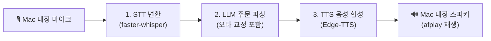

# 🖥️ Mac 로컬 전용 실시간 음성 테스트 (`testinlocal`)

본 폴더는 Mac 개발 환경에서 **실제 Mac 내장 마이크로 말하고 내장 스피커로 안내 음성을 들으며** 음성 키오스크 파이프라인(STT ➔ LLM ➔ TTS)을 자유롭게 테스트하기 위한 **Mac 전용 로컬 테스트 모듈**입니다.

---

## 🎯 특징 및 주요 흐름



1. **Mac 내장 마이크 입력**: 엔터키를 누르고 음성 주문을 말하면 VAD(3초 감지)로 자동 녹음
2. **STT (Speech-to-Text)**: `faster-whisper`로 텍스트 자동 변환
3. **LLM 주문 파싱**: `바릴라랍때`, `아이스틱`, `초코랫대` 등 STT 음성 오타를 메뉴판으로 자동 교정 및 장바구니 JSON 추출
4. **TTS & Mac 스피커 출력**: `Edge-TTS`로 생성된 자연스러운 한국어 안내음을 Mac 스피커(`afplay`)로 즉시 출력

---

## 🚀 Mac 로컬 실행 방법

Mac 터미널에서 다음 명령어를 실행합니다:

```bash
# 1. 저장소 최상위 디렉터리로 이동
cd /Users/hschae/work/stts

# 2. Mac 전용 로컬 테스트 실행
python3 testinlocal/main_mac.py
```

---

## 💻 실행 모습 예시

```text
👉 엔터(Enter) 키를 누르고 Mac 마이크에 음성 주문을 말씀하세요...
🎙️ [마이크] 말씀을 시작해 주세요... (주문내용 입력 중)
⏹️ [마이크] 음성 입력 종료 감지 (말씀 종료)
📝 [STT] 음성 인식(STT) 변환 시작...
🎯 [STT 결과]: "아이스티 두잔 초코랫대 세잔 주세요"
🧠 [LLM] 입력 원문: "아이스티 두잔 초코랫대 세잔 주세요" ➔ 발음 교정: "아이스티 두잔 초코 라떼 세잔 주세요"

🛒 [키오스크 장바구니 결과]
   1. 아이스티: 2잔
   2. 초코 라떼: 3잔
💬 [안내 멘트]: "아이스티 2잔, 초코 라떼 3잔 맞으신가요? 카드리더기에 카드를 꽂아주세요."
🗣️ [TTS] 안내 음성 합성 시작... (엔진: edge-tts)
🔊 [스피커] 안내 음성 재생 중... (Mac 내장 스피커 afplay 재생)
```
